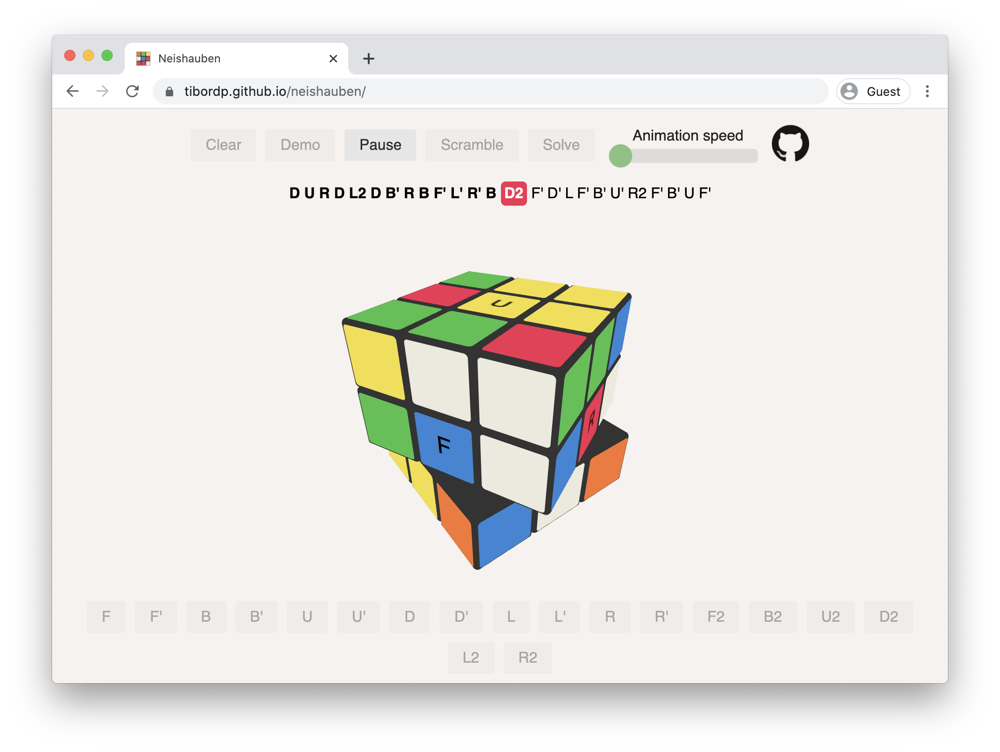

# Neishauben

Neishauben is an in-browser Rubik's cube simulator with an included LBL (Beginners Method) solver.

## [See it live here!](https://tibordp.github.io/neishauben)



Main functionality (operations on Rubik's Cube and the solver itself) is implemented in C (see [here](./src/runtime)) and compiled with Emscripten and the cube simulator is written in JavaScript using Three.js for 3D graphics.

## Development

Build process requires Docker in order to compile C code to WebAssembly. The frontend is built with [Vite](https://vitejs.dev/) and uses [pnpm](https://pnpm.io/) as the package manager.

### Local development

Install dependencies:

```bash
pnpm install
```

Run the development build locally

```bash
pnpm wasm:dev
pnpm dev
```

The app will launch at
http://localhost:5173/neishauben/

Tests run with Vitest (make sure C code is compiled first with `pnpm wasm:dev`)

```bash
pnpm test
```

In production build, optimization lookup tables are pre-generated during the build process and baked into the resulting WebAssembly to save on startup time (at the expense of asset size). For developing a production build:

```bash
pnpm wasm:production
pnpm dev
```

### Production build

```bash
pnpm build
```

The built site can be previewed locally with

```bash
pnpm preview
```
