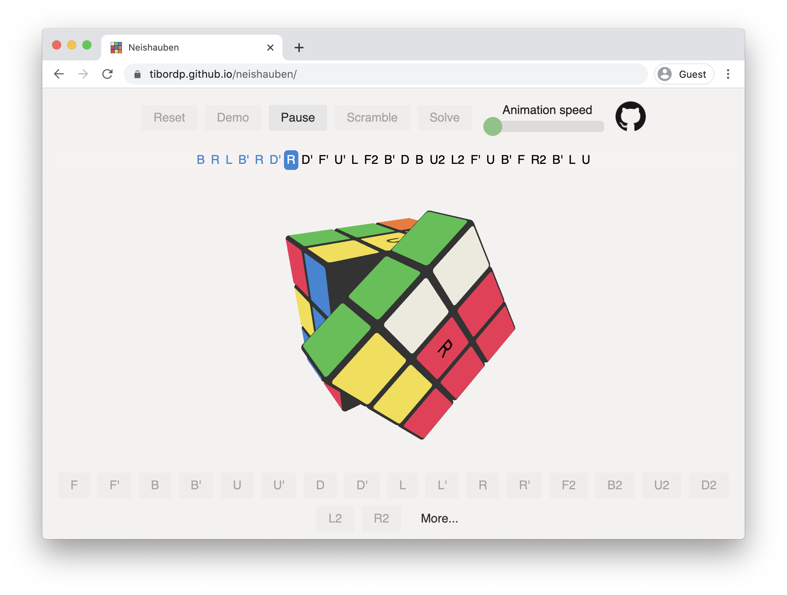

# Neishauben

Neishauben is an in-browser Rubik's cube simulator with an included LBL (Beginners Method) solver.

## [See it live here!](https://tibordp.github.io/neishauben)



Main functionality (operations on Rubik's Cube and the solver itself) is implemented in C (see [here](./src/rubiks.c)) and compiled with Emscripten and the cube simulator is written in JavaScript using Three.js for 3D graphics.

## Development

Build process requires Docker in order to compile C code to WebAssembly.

### Local development

```bash
yarn
yarn dev
```

The app will launch at 
https://localhost:8080/neishauben/

Tests run with
```bash
yarn test
```

### Production build 

```
yarn build
```